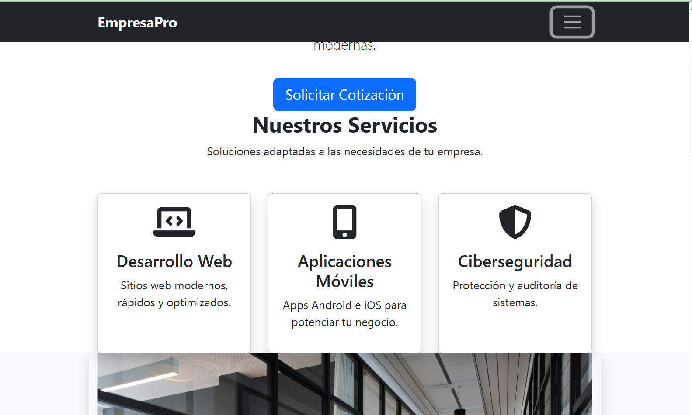
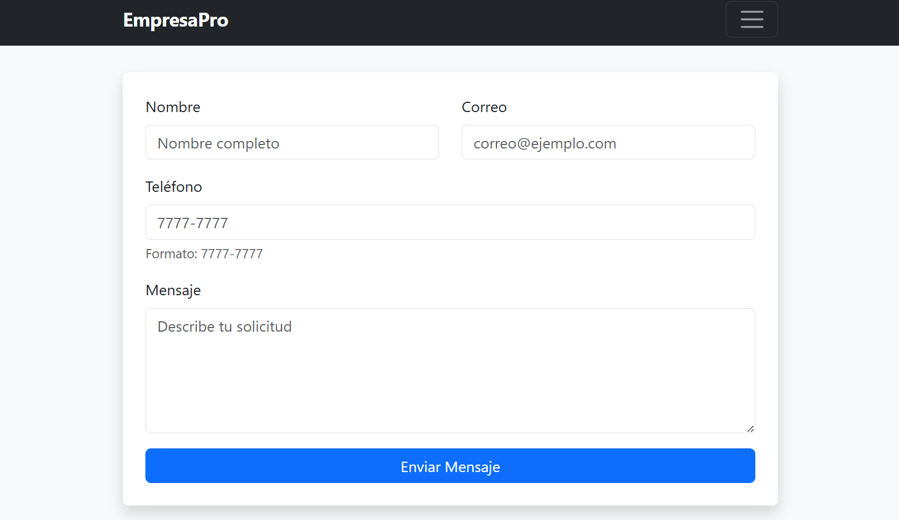

#  EmpresaPro - Landing Page Corporativa

¡Bienvenido al repositorio de **EmpresaPro**! Esta es una landing page moderna, responsiva y optimizada, diseñada para una agencia de servicios digitales que busca impulsar negocios al siguiente nivel mediante desarrollo web, marketing y ciberseguridad.

 

https://pagina-empresapro.vercel.app/ 

##  Captura de Pantalla

##  Características

* **Diseño 100% Responsivo:** Adaptado perfectamente para celulares, tablets y computadoras de escritorio.
* **Sección Hero de Alto Impacto:** Una sección principal moderna con fondo interactivo y tipografía estilizada.
* **Sección de Servicios Dinámica:** Tarjetas de servicios (`service-card`) con animaciones suaves de elevación (`hover`) al pasar el cursor.
*  **Navegación Fija (`Fixed-Top`):** Menú de navegación superior que acompaña al usuario durante todo el recorrido por la página.

---

##  Tecnologías Utilizadas

Este proyecto fue construido utilizando tecnologías web estándar y frameworks modernos:

* **HTML5:** Estructura semántica y limpia.
* **CSS3 Personalizado:** Estilos avanzados, variables, Flexbox para el centrado vertical, gradientes lineales y efectos de transición.
* **Bootstrap 5:** Framework de diseño utilizado para acelerar el desarrollo del sistema de rejillas (`grid`), tipografía (`display-3`) y componentes responsivos.
EmailJS: Integración de API de terceros para el procesamiento y envío de formularios de contacto directamente a una bandeja de correo electrónico corporativa sin requerir infraestructura de servidor dedicada.
---

## Despliegue (Deploy)

Este proyecto está configurado para un despliegue continuo utilizando **Vercel**. Cada vez que se realiza un cambio en la rama principal de este repositorio de GitHub, el sitio en producción se actualiza automáticamente.

---

## 👤 Autor

Desarrollado  por: Arnoldo Juarez
